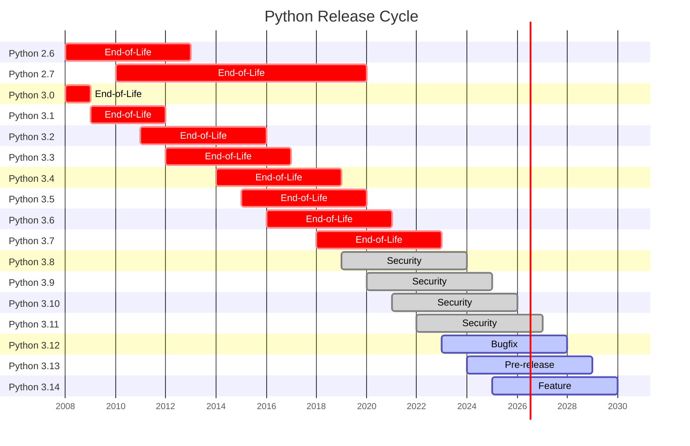

## Python

### Tool

- [[Python-Version#Version]]
- Package Management<a href="#footnote-management">1</a>
- Code Formatting<a href="#footnote-formatting">2</a>
- [[Testing]]<a href="#footnote-testing">3</a>
- Source control<a href="#footnote-source">4</a> & Continuous Integration(CI)<a href="#footnote-ci">5</a>
- <a href="FastAPI-Application.md#Default Python Package">Web Tool</a>

### Subtitle

- [[./Python-API-&-Service|API & Service]] 

- [[./Python-Variable|Variable]] 

- [[./Type-Hint|Type-Hint]] 

- [[Py Data Structure|Data Structure]] 

- [[./Python-Web-Framework|Web Framework]]

---

Footnotes

<ol>
  <li id="footnote-management">전통적으로는 pip 를 사용, &nbsp;<a href="Virtual.md">Virtual Environment</a> 를 사용하거나 <a href="Poetry.md">Poetry</a> 같은 대체제 고려 가능
    <a href="#management-ref" title="Return">↩</a>
  </li>
  <li id="footnote-formatting">중요하지만 다른 것들에 비해 중요도 떨어짐, &nbsp;불필요한 논쟁을 피하기 위해선 자동화된 &nbsp;Formatting Tool 을 사용
    <ul>
      <li style='margin-bottom: 0.35em'>Ex) &nbsp;<a href="https://black.readthedocs.io">black</a>, &nbsp;<code>pip install black</code>
        <a href="#formatting-ref" title="Return">↩</a>
      </li>
    </ul>
  </li>
  

  <li id="footnote-testing"><code>unittest</code> 가 Standard Python Test Package
    <ul>
      <li style='margin-bottom: 0.35em'>하지만, &nbsp;대부분의 Python Developer 는 <a href="https://docs.pytest.org">pytest</a> 사용</li>
      <li style='margin-bottom: 0.35em'>Ex) <code>pip install pytest</code>
        <a href="#testing-ref" title="Return">↩</a>
      </li>
    </ul>
  </li>
  

  <li id="footnote-source"><a href="https://git-scm.com/docs">Git</a> 이 현재 가장 보편적인 시스템
    <ul>
      <li><a href="https://docs.github.com/ko">Github</a> & <a href="https://gitlab-docs.infograb.net/">GitLab</a> 등의 Platform 에서 Git Storage Hosting</li>
      <li>All Programming Languages 에 &nbsp;사용 가능
        <a href="#source-ref" title="Return">↩</a>
      </li>
    </ul>
  </li>
  

  <li id="footnote-ci"><b>pre-commit</b>
    <ul>
      <li>Local 에서 Commit 전 Test 실행 가능</li>
      <li>Ex) &nbsp;<a href="https://black.readthedocs.io">black</a>, &nbsp;<a href="https://docs.pytest.org">pytest</a>
      <li>Remote Repository 에 Push 후 추가 <b>CI</b> Test 가능
        <a href="#ci-ref" title="Return">↩</a>
      </li>
    </ul>
  </li>
</ol>
